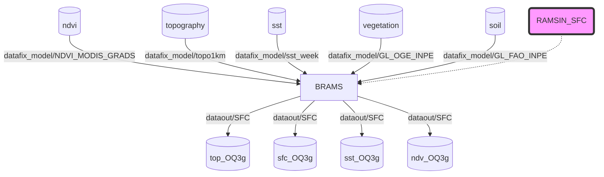
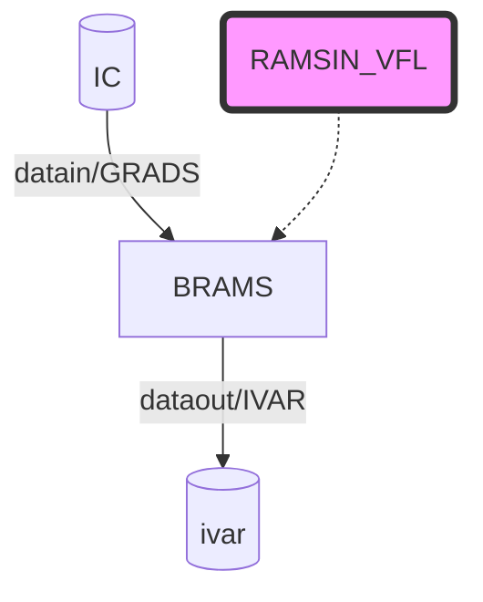

1. ## Running a small meteorological case

The BRAMS Model is a limited area model and therefore requires input data from outputs from a global model. In the test case presented here, these data are already ready and available. For "expert" cases a new document shows how to get this data and generate it. The BRAMS model runs in 3 distinct phases:

i) **MAKESFC** - Creates the surface files using the input files that contain global them and adjusts them to the specifications chosen by the user and arranged in the input namelist. The BRAMS namelist is called RAMSIN.



ii) **MAKEVFILE** - From the global data the phase creates the files with the boundary conditions and initial conditions interpolating them to the specifications chosen by the user and arranged in THE RAMSIN.



iii) **INITIAL** - This is the phase of model time integration where prediction data will be produced as specified in RAMSIN.

```mermaid
graph TD;
    RAMSIN(RAMSIN_INI)-.->BRAMS
    TABLES(tables...)-. tables -->BRAMS
    style RAMSIN fill:#f9f,stroke:#333,stroke-width:4px
    style TABLES fill:#bbf,stroke:#f66,stroke-width:2px,color:#fff
    TOPFILES[(top_OQ3g)]-- dataout/SFC -->BRAMS
    SFCFILES[(sfc_OQ3g)]-- dataout/SFC -->BRAMS
    SSTFPFX[(sst_OQ3g)]-- dataout/SFC -->BRAMS
    NDVIFPFX[(ndv_OQ3g)]-- dataout/SFC -->BRAMS
    IVAR[(ivar)]-- dataout/IVAR -->BRAMS
    UMID[(GL_SM.GPNR)]-- datain/UMID -->BRAMS
    VAR(variables.csv)-.->BRAMS
    BRAMS-- dataout/POST -->POST[(brams-meteo...grads)]
    style POST fill:#2bf,stroke:#ff0,stroke-width:2px,color:#ff0
    BRAMS-- dataout/HIS -->HIS[(history)]
    BRAMS-- dataout/ANL -->ANA[(analisys)]
```

> WARNING: The first two phases (i and ii) should only be rotated with 1 processor!

The test case is small enough to run on a laptop or desktop with 3 processors and with 8GB memory. It covers an area as shown in the figure below.


This area is configured in RAMSIN with 60x60x45 points (x,y,z), 20 km of horizontal resolution (surface) and is centered at 22.6S, 45.2W. The test only allows it to run for 24 hours of forecast. After the end of the round, one can verify the behavior of the model by comparing the results that were produced and are in {YOUR_BIN_AREA}/dataout/POST with those stored in the {YOUR_BIN_AREA}/dataout/POST_COMPARE area. To look at the outputs (GRADS/CTL format) you need to know how to use grads software

> WARNING: Make sure your environment is tuned to use the packages installed in the pre-requirements (PATH and LD_LIBRARY_PATH) To look at the outputs (GRADS/CTL format) you need to know how to use grads software..

```bash
cd {YOUR_BIN_AREA}
mpirun -np 1 brams-6.0 -f RAMSIN_SFC_MID
mpirun -np 1 brams-6.0 -f RAMSIN_VFL_MID
mpirun -np 3 brams-6.0 -f RAMSIN_INI_MID
```

A series of logs will be shown on the screen in each of the 3 phases. Be aware of errors reported in these logs. Often there are non-existent files that have not been properly downloaded in the download or the system has some limitation. In the INITIAL phase you can follow the integrations by looking at the screen. It shows each timestep performed and other important information. See for example the figure below that shows part of these messages.


2. ### How to generate Initial and Boundary conditions (IC) from global data

The program "pre" created in item 3 above is the program that get data from global input files and converted them to IC for BRAMS. First of all You must edit a namelist file named **pre.nm**l. See the example bellow

```
$ARGS_INPUT

!!!!! DATE !!!!!

init_year  = 2020,
init_month = 08,
init_day   = 18,
init_hour  = 0,
final_year = 2020,
final_month= 08,
final_day = 19,
final_hour = 00,

!!!!! TIME STEP !!!!!!!

step  = 6, !Timestep in hours

!!!!! ATMOS !!!!!
atmos_type   = 1, !0=DP, 1=GFS Grib2, 2=ERA5
atmos_prefix ='gfs.t00z.pgrb2.0p25.f',
atmos_sufix  ='.2020081800.grib2',
atmos_idir   ='./datain/GFS/',
levels = 23,
initial_latitude = -70., !initial latitude for domain of model (-90 to 90)  
final_latitude  = 20., !final latitude for domain of model(-90 to 90)
initial_longitude = 250., !initial longitude for domain of model (0 to 360)
final_longitude = 358., !Final longitude for domain of model (0 to 360)

!!!!! CHEM !!!!!! 
chem_type     = 1, !0 = no Chem, 1 = CAMS 
chem_idir  = "./datafix_cams/",
chem1_prefix ='',
chem1_sufix  ='-CAMS-EC-2010-2019-AMS',

!!!!! OUTPUT !!!!!
out_type   = 2, !0=text, 1=VFM, 2=Grads
out_prefix = 'IC',
out_sufix  = '',
out_dir    = './datain/GRADS/',

$END
```

The namelist is prepared for test case You have downloaded in item 4. After You edit it You must run the pre.

```bash
./pre
```

A lot of information will be show in screen and some files with IC will be write in the **out_dir** You fill in namelist._

```
$ls datain/GRADS -latr
rw-r--r--   1   lufla   lufla      2 KiB   Mon Sep 13 14:23:59 2021    IC2021011318.ctl 
rw-r--r--   1   lufla   lufla      2 KiB   Wed Oct  6 10:15:40 2021    IC2020081800.ctl 
rw-r--r--   1   lufla   lufla    297 MiB   Wed Oct  6 10:15:41 2021    IC2020081800.gra 
rw-r--r--   1   lufla   lufla      2 KiB   Wed Oct  6 10:15:43 2021    IC2020081806.ctl 
rw-r--r--   1   lufla   lufla    297 MiB   Wed Oct  6 10:15:44 2021    IC2020081806.gra 
rw-r--r--   1   lufla   lufla      2 KiB   Wed Oct  6 10:15:46 2021    IC2020081812.ctl 
rw-r--r--   1   lufla   lufla    297 MiB   Wed Oct  6 10:15:47 2021    IC2020081812.gra 
rw-r--r--   1   lufla   lufla      2 KiB   Wed Oct  6 10:15:49 2021    IC2020081818.ctl 
rw-r--r--   1   lufla   lufla    297 MiB   Wed Oct  6 10:15:51 2021    IC2020081818.gra 
rw-r--r--   1   lufla   lufla      2 KiB   Wed Oct  6 10:15:53 2021    IC2020081900.ctl 
rw-r--r--   1   lufla   lufla    297 MiB   Wed Oct  6 10:15:54 2021    IC2020081900.gra
```

This files will be used as inut for BRAMS´Model.

3. ### Download GFS Data for model

The BRAMS comes with a script in bash that get data from GFS from NCEP site. To get the data just run the script passing yera, month, day and output folder

```bash
./getGFS.sh 2021 10 02 ./datain/GFS/
```

In the example above gfs data is downloaded for 02Oct2021 and the data will be put in ./datain/GFS/ directory.

4. ### How to filter the log output

Supposed You run the model and put the output in a file. See example:

```bash
cd {YOUR_BIN_AREA}
mpirun -np 3 brams-6.0 -f RAMSIN_INI_MID >& output.txt
```

If You open the file output.txt using a specific editor (for example: vi) You will see all escape characters used for color the output. Example bellow ( a small peace of output log read by vi editor):

```
+--------------+--------------+
|  variable    |    grid 1    |
+--------------+--------------+
^[[30m^[[47m|NNXP          |          0060|^[[0m
^[[0m|NNYP          |          0060|^[[0m
^[[30m^[[47m|NNZP          |          0045|^[[0m
^[[0m|NXTNEST       |          0000|^[[0m
^[[30m^[[47m|NSTRATX       |          0001|^[[0m
^[[0m|NSTRATY       |          0001|^[[0m
```

This may appear a little bit confused. To solve the problema You must only run the filter (created in item 3 above) that comes with BRAMS model. Try

```bash
filter output.txt
```

And then, You can see the same file with this look

```
+--------------+--------------+
|  variable    |    grid 1    |
+--------------+--------------+
|NNXP          |          0060|
|NNYP          |          0060|
|NNZP          |          0045|
|NXTNEST       |          0000|
|NSTRATX       |          0001|
|NSTRATY       |          0001|
```

---

---
